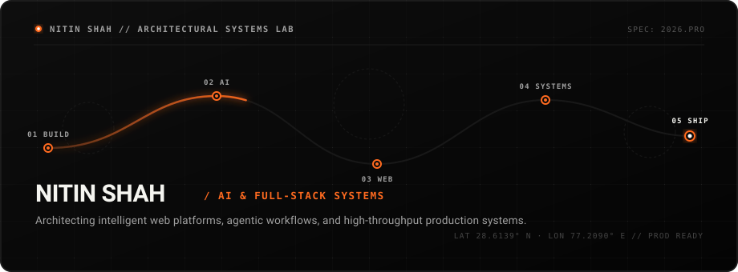
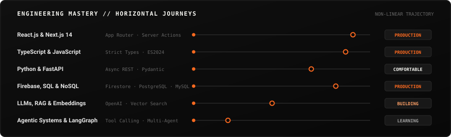

<div align="center">
  <!-- 01 HERO: Signature Animated Intelligent Orange Thread -->
  <a href="https://github.com/nitinshah69">
    
  </a>

  <!-- 02 STATUS BAR: Pulse Indicator & Timezone -->
  
</div>

<br/>

## 🧭 03 / NOW · 2026 Command Center

```ini
[● BUILDING]   : Production AI Tooling & Scalable Next.js 14 Micro-Architectures
[● LEARNING]   : Agentic Workflows, LangGraph & Structured LLM Tool-Calling
[● EXPLORING]  : Production AI Observability & Low-Latency Edge Inference
[● 2026 TARGET]: Senior Full-Stack & AI Systems Engineering
```

---

## 🏛️ 04 / About & Positioning

I am an **AI-focused Full-Stack Software Engineer** dedicated to building resilient web platforms, autonomous agentic workflows, and high-throughput systems.

```text
Focus:   Modern Frontend Architecture · GenAI Engineering · High-Throughput Systems
Mission: Bridging scalable full-stack web platforms with pragmatic machine intelligence.
```

---

## 💡 05 / What I Build

<table>
  <tr>
    <td width="33%" valign="top">
      <h4>🤖 Intelligent Products</h4>
      <p>AI-native web applications embedding LLM inference, vector retrieval (RAG), and agentic workflows to automate high-friction tasks.</p>
      <code>Next.js</code> · <code>FastAPI</code> · <code>OpenAI</code>
    </td>
    <td width="33%" valign="top">
      <h4>⚡ Full-Stack Systems</h4>
      <p>High-concurrency web platforms with optimized relational schemas, microsecond state synchronizations, and robust RBAC permissions.</p>
      <code>TypeScript</code> · <code>Node</code> · <code>Postgres</code>
    </td>
    <td width="33%" valign="top">
      <h4>🎨 Interactive Experiences</h4>
      <p>Ultra-responsive, accessible user interfaces built with micro-interactions, optimistic updates, and modern design precision.</p>
      <code>React</code> · <code>Tailwind</code> · <code>Motion</code>
    </td>
  </tr>
</table>

---

## 🛠️ 06 / Current Stack & Architectural Layers

<table>
  <tr>
    <td width="20%" valign="top">
      <h4>Layer 01<br/>Interface</h4>
      <ul>
        <li><code>React.js</code></li>
        <li><code>Next.js 14</code></li>
        <li><code>TypeScript</code></li>
        <li><code>Tailwind CSS</code></li>
      </ul>
    </td>
    <td width="20%" valign="top">
      <h4>Layer 02<br/>Application</h4>
      <ul>
        <li><code>Node.js</code></li>
        <li><code>Express.js</code></li>
        <li><code>FastAPI</code></li>
        <li><code>Python</code></li>
      </ul>
    </td>
    <td width="20%" valign="top">
      <h4>Layer 03<br/>Persistence</h4>
      <ul>
        <li><code>PostgreSQL</code></li>
        <li><code>Firestore</code></li>
        <li><code>MySQL</code></li>
        <li><code>MongoDB</code></li>
      </ul>
    </td>
    <td width="20%" valign="top">
      <h4>Layer 04<br/>Intelligence</h4>
      <ul>
        <li><code>LLM APIs</code></li>
        <li><code>RAG Systems</code></li>
        <li><code>Embeddings</code></li>
        <li><code>LangGraph</code></li>
      </ul>
    </td>
    <td width="20%" valign="top">
      <h4>Layer 05<br/>Infra</h4>
      <ul>
        <li><code>Ubuntu Linux</code></li>
        <li><code>Docker</code></li>
        <li><code>GitHub CI/CD</code></li>
        <li><code>Vercel</code></li>
      </ul>
    </td>
  </tr>
</table>

---

## 📈 07 / Skill Progress System

<div align="center">
  <!-- Horizontal Journey Progress Lines -->
  
</div>

---

## 🌌 08 / Architectural Dependency Constellation

<div align="center">
  <!-- Architecture Constellation -->
  
</div>

---

## 🗺️ 09 / My 2026 Learning Path

<div align="center">
  <!-- Learning Horizon -->
  
</div>

---

## 🚀 10 / Featured Project Showcases

### 01 / AambaaLabs E-Commerce Infrastructure
<div align="center">
  
</div>

```text
Maturity:  [ PRODUCTION ────────────● ]
Radar:     Frontend: 95% | Backend: 90% | Database: 85% | Infra: 80%
```

- **Problem Solved:** Enterprise client needed unified store management, live multi-channel inventory synchronization, and automated billing.
- **My Role:** Lead Full-Stack Solutions Engineer.
- **Tech Stack:** `Next.js 14` · `React 18` · `Tailwind CSS` · `Firebase Firestore` · `Cloud Functions`
- **Technical Highlight:** Reduced inventory update latency below 120ms utilizing optimistic mutations and Firestore real-time snapshot listeners.
- **Links:** [Live Deployment ↗](https://github.com/nitinshah69) &nbsp;|&nbsp; [Source Code ↗](https://github.com/nitinshah69/aambaalabs-dashboard)

---

### 02 / AI Resume Intelligence Platform
<div align="center">
  
</div>

```text
Maturity:  [ MVP ──────────● ]
Radar:     AI / LLM: 92% | Frontend: 90% | Backend: 85% | Database: 75%
```

- **Problem Solved:** Job applicants lack transparent feedback on ATS alignment, semantic keyword gaps, and industry role fit.
- **My Role:** Creator & Full-Stack AI Engineer.
- **Tech Stack:** `Next.js` · `FastAPI` · `Python` · `OpenAI API` · `PostgreSQL`
- **Technical Highlight:** Designed semantic vector embedding pipeline for multi-dimension resume-to-job matching with low-hallucination structured JSON outputs.
- **Links:** [Live Demo ↗](https://github.com/nitinshah69) &nbsp;|&nbsp; [Source Code ↗](https://github.com/nitinshah69)

---

### 03 / Enterprise Cloud Workflow Hub
<div align="center">
  
</div>

```text
Maturity:  [ PRODUCTION ────────────● ]
Radar:     Backend: 92% | Database: 90% | Frontend: 88% | Infra: 75%
```

- **Problem Solved:** Streamlined multi-department institutional operations by replacing manual administrative workflows with audited digital processes.
- **My Role:** Lead Full-Stack Developer.
- **Tech Stack:** `React.js` · `PHP Backend` · `MySQL` · `Tailwind CSS` · `JWT Authentication`
- **Technical Highlight:** Built scalable relational schemas with strict role-based access control (RBAC), resulting in a 65% reduction in manual turnaround time.
- **Links:** [Live Demo ↗](https://github.com/nitinshah69) &nbsp;|&nbsp; [Source Code ↗](https://github.com/nitinshah69/capstone-project)

---

### 04 / RECKON 7.0 Real-Time Hackathon Sprint Engine
<div align="center">
  
</div>

```text
Maturity:  [ MVP ──────────● ]
Radar:     Frontend: 94% | Database: 82% | Backend: 80% | Infra: 70%
```

- **Problem Solved:** Built a collaborative real-time digital application under a high-pressure 24-hour sprint.
- **My Role:** Core Frontend & Realtime State Lead.
- **Tech Stack:** `Next.js` · `TypeScript` · `Tailwind CSS` · `Firebase Realtime DB`
- **Technical Highlight:** Architected collision-free multi-client state management for concurrent collaborative sessions.
- **Links:** [Live Demo ↗](https://github.com/nitinshah69) &nbsp;|&nbsp; [Source Code ↗](https://github.com/nitinshah69/reckon-hackathon)

---

## 🔄 11 / Project Execution Pipeline

<div align="center">
  <!-- Stage-Gate Project Pipeline -->
  
</div>

---

## 📊 12 / Activity Signal & Telemetry

<div align="center">
  <!-- Minimal Monochrome Stats Card with Orange Accent -->
  
  
</div>

---

## 🐍 13 / Contribution Signal Visual

<div align="center">
  <!-- Contribution Snake in Minimal Palette -->
  
</div>

---

## 🌐 14 / 3D Contribution Wall

<div align="center">
  <!-- 3D Isometric Contribution Topography -->
  
</div>

---

## 🗓️ 15 / 2026 Development Log & Timeline

```text
Q1 2026 ─── Q2 2026 ─────────────── Q3 2026 ───────────────── Q4 2026
  │           │                       │                         │
  ▼           ▼                       ▼                         ▼
[FOUNDATIONS] [FULL-STACK DEPLOY]     [GENAI & AGENTIC APPS]    [SCALE & PRODUCTION]
CS Concepts   Next.js 14 / Firebase   FastAPI / LangGraph / RAG Scalable Cloud SaaS
```

---

## 🔭 16 / Currently Exploring

- `→` Autonomous multi-agent coordination protocols (`LangGraph` / `LangChain`)
- `→` Edge-native AI model inference & streaming JSON responses
- `→` Vector database indexing optimizations (`Pinecone` / `pgvector`)
- `→` Advanced motion physics and micro-interactions in modern web apps

---

## 📐 17 / Engineering Principles // How I Think

```ini
[01] SOLVE THE PROBLEM FIRST
     Understand constraints, user friction, and data flow before writing code.

[02] KEEP SYSTEMS COMPOSABLE
     Type-safe interfaces, decoupled services, and predictable state transitions.

[03] LEVERAGE AI INTENTIONALLY
     Apply machine intelligence where it delivers measurable leverage, not as decoration.

[04] SHIP, MEASURE & ITERATE
     Continuous delivery, real-world observability, and relentless performance tuning.
```

---

## 🪐 18 / Technology Orbit

<div align="center">
  <!-- Subtle Rotating Technology Orbit -->
  
</div>

---

## 🤝 19 / Open Source & Collaboration

I actively contribute to and build open-source tools across web infrastructure, AI prototypes, and full-stack utilities.

- **Collaborate on GitHub:** [github.com/nitinshah69 ↗](https://github.com/nitinshah69)
- **Report an Issue / Suggestion:** Open an issue on any active repository.

---

## 📬 20 / Connect & Final CTA

<div align="center">
  <p><b>Have an interesting engineering problem to solve or a high-impact product to build?</b></p>
  
  <a href="https://linkedin.com/in/nitinshah69">
    
  </a>
  &nbsp;
  <a href="mailto:nitinshah@example.com">
    
  </a>
  &nbsp;
  <a href="https://github.com/nitinshah69">
    
  </a>

  <br/><br/>

  <!-- 37 Signature Closing: The Orange Thread Arrow -->
  
</div>
