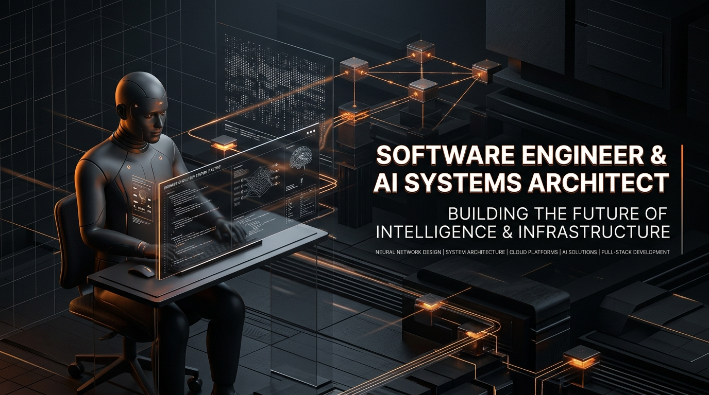
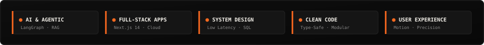
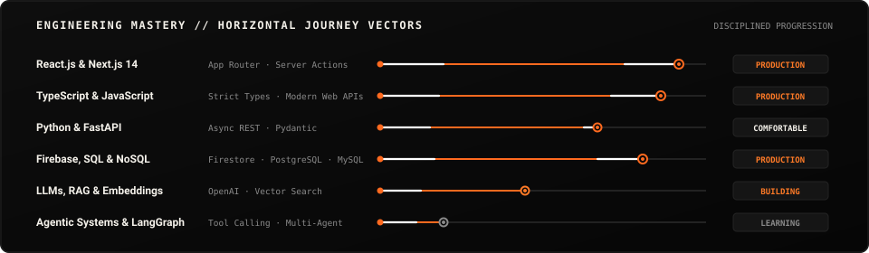
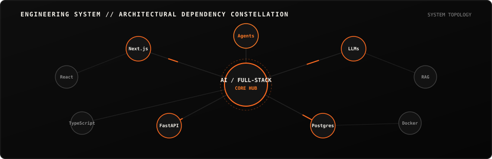
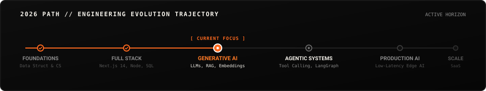
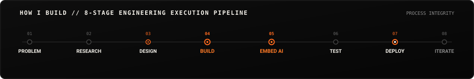
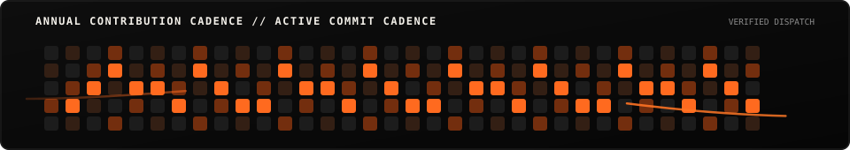
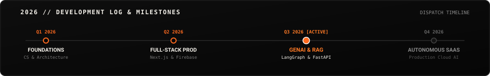

<div align="center">

  <!-- ==================== 01 / 3D CINEMATIC AI SYSTEMS BANNER ==================== -->
  <a href="https://github.com/nitinshah69">
    
  </a>

  <!-- ==================== 02 / SYSTEM STATUS BAR ==================== -->
  

</div>

<br/>

## 01 / ABOUT

AI-focused Full-Stack Software Engineer building reliable, high-performance web products and agentic workflows. Focused on modern web architecture, distributed systems, and embedding practical machine intelligence to eliminate high-friction operations.

---

## 02 / CURRENTLY FOCUSED ON

<div align="center">
  
</div>

---

## TECH STACK // LAYERED ARCHITECTURE

<table>
  <tr>
    <td width="20%" valign="top">
      <h4>INTERFACE</h4>
      <ul>
        <li><code>React.js</code></li>
        <li><code>Next.js 14</code></li>
        <li><code>TypeScript</code></li>
        <li><code>Tailwind CSS</code></li>
      </ul>
    </td>
    <td width="20%" valign="top">
      <h4>APPLICATION</h4>
      <ul>
        <li><code>Node.js</code></li>
        <li><code>Express.js</code></li>
        <li><code>FastAPI</code></li>
        <li><code>Python</code></li>
      </ul>
    </td>
    <td width="20%" valign="top">
      <h4>DATA</h4>
      <ul>
        <li><code>PostgreSQL</code></li>
        <li><code>MongoDB</code></li>
        <li><code>Firebase / Firestore</code></li>
        <li><code>MySQL</code></li>
      </ul>
    </td>
    <td width="20%" valign="top">
      <h4>AI</h4>
      <ul>
        <li><code>Python</code></li>
        <li><code>LLMs</code></li>
        <li><code>RAG Systems</code></li>
        <li><code>LangGraph</code></li>
      </ul>
    </td>
    <td width="20%" valign="top">
      <h4>INFRASTRUCTURE</h4>
      <ul>
        <li><code>Docker</code></li>
        <li><code>Git &amp; GitHub Actions</code></li>
        <li><code>Ubuntu Linux</code></li>
        <li><code>Vercel</code></li>
      </ul>
    </td>
  </tr>
</table>

---

## SKILL SYSTEM // JOURNEY PROGRESSION

<div align="center">
  
</div>

---

## 03 / ENGINEERING SYSTEM

<div align="center">
  
</div>

---

## 04 / 2026 PATH

<div align="center">
  
</div>

---

## HOW I BUILD // EXECUTION LIFECYCLE

<div align="center">
  
</div>

---

## 05 / SELECTED WORK

### 01 / AambaaLabs E-Commerce Infrastructure
<div align="center">
  
</div>

```text
Maturity: [ PRODUCTION ────────────● ]
Radar:    Frontend: 95% | Backend: 90% | Database: 85% | Infra: 80%
```

- **Description:** Real-time store management, inventory synchronization, and automated billing engine.
- **Tech Stack:** `Next.js 14` · `React 18` · `Tailwind CSS` · `Firebase Firestore`
- **Key Technical Feature:** Reduced inventory update latency below 120ms utilizing optimistic mutations and Firestore real-time snapshot listeners.
- **Links:** [Live Deployment ↗](https://github.com/nitinshah69) &nbsp;|&nbsp; [Source Code ↗](https://github.com/nitinshah69/aambaalabs-dashboard)

---

### 02 / AI Resume Intelligence Platform
<div align="center">
  
</div>

```text
Maturity: [ MVP ──────────● ]
Radar:    AI / LLM: 92% | Frontend: 90% | Backend: 85% | Database: 75%
```

- **Description:** LLM-powered resume parsing, ATS scoring vectors, and semantic keyword gap analysis.
- **Tech Stack:** `Next.js` · `FastAPI` · `Python` · `OpenAI API` · `PostgreSQL`
- **Key Technical Feature:** Designed semantic vector embedding pipeline for multi-dimension resume-to-job matching with low-hallucination structured JSON outputs.
- **Links:** [Live Demo ↗](https://github.com/nitinshah69) &nbsp;|&nbsp; [Source Code ↗](https://github.com/nitinshah69)

---

### 03 / Enterprise Cloud Workflow Hub
<div align="center">
  
</div>

```text
Maturity: [ PRODUCTION ────────────● ]
Radar:    Backend: 92% | Database: 90% | Frontend: 88% | Infra: 75%
```

- **Description:** Institutional operations automation with role-based access, MySQL schemas, and reporting.
- **Tech Stack:** `React.js` · `PHP Backend` · `MySQL` · `Tailwind CSS` · `JWT Authentication`
- **Key Technical Feature:** Built scalable relational schemas with strict role-based access control (RBAC), resulting in a 65% reduction in manual turnaround time.
- **Links:** [Live Demo ↗](https://github.com/nitinshah69) &nbsp;|&nbsp; [Source Code ↗](https://github.com/nitinshah69/capstone-project)

---

### 04 / RECKON 7.0 Real-Time Hackathon Sprint Engine
<div align="center">
  
</div>

```text
Maturity: [ MVP ──────────● ]
Radar:    Frontend: 94% | Database: 82% | Backend: 80% | Infra: 70%
```

- **Description:** Collaborative real-time digital application built under a high-pressure 24-hour sprint.
- **Tech Stack:** `Next.js` · `TypeScript` · `Tailwind CSS` · `Firebase Realtime DB`
- **Key Technical Feature:** Architected collision-free multi-client state management for concurrent collaborative sessions.
- **Links:** [Live Demo ↗](https://github.com/nitinshah69) &nbsp;|&nbsp; [Source Code ↗](https://github.com/nitinshah69/reckon-hackathon)

---

## 06 / GITHUB ACTIVITY

<div align="center">
  
  
</div>

---

## ANNUAL CONTRIBUTION CADENCE

<div align="center">
  
</div>

---

## 3D CONTRIBUTION TOPOGRAPHY

<div align="center">
  
</div>

---

## 07 / DEVELOPMENT LOG

<div align="center">
  
</div>

---

## 08 / CURRENTLY EXPLORING

- `→` Autonomous multi-agent coordination protocols (`LangGraph` / `LangChain`)
- `→` Low-latency edge-native AI model inference & streaming structured JSON responses
- `→` Vector database indexing optimizations (`Pinecone` / `pgvector`)
- `→` Advanced motion physics and micro-interactions in modern web systems

---

## 09 / HOW I THINK // ENGINEERING PRINCIPLES

<table>
  <tr>
    <td width="25%" valign="top">
      <h4>01 // INTENT</h4>
      <p><b>Solve The Real Problem</b></p>
      <p>Understand user constraints, data flow, and product requirements before writing a single line of code.</p>
    </td>
    <td width="25%" valign="top">
      <h4>02 // CLARITY</h4>
      <p><b>Keep Systems Simple</b></p>
      <p>Modular, type-safe, and self-documenting codebases outperform clever but opaque architectures.</p>
    </td>
    <td width="25%" valign="top">
      <h4>03 // LEVERAGE</h4>
      <p><b>Use AI With Purpose</b></p>
      <p>Embed artificial intelligence strictly where it provides concrete ROI and frictionless automation.</p>
    </td>
    <td width="25%" valign="top">
      <h4>04 // VELOCITY</h4>
      <p><b>Ship And Iterate</b></p>
      <p>Continuous telemetry, benchmarking, and rapid release cycles to evolve products in the real world.</p>
    </td>
  </tr>
</table>

---

## OPEN SOURCE & COLLABORATION

I actively contribute to and build open-source tools across web infrastructure, AI prototypes, and full-stack utilities.

- **Collaborate on GitHub:** [github.com/nitinshah69 ↗](https://github.com/nitinshah69)
- **Report an Issue / Suggestion:** Open an issue on any active repository.

---

## CONTACT // LET'S BUILD SOMETHING USEFUL

<div align="center">
  <p><b>Have an interesting engineering problem to solve or a high-impact product to build?</b></p>
  
  <a href="https://linkedin.com/in/nitinshah69">
    
  </a>
  &nbsp;
  <a href="mailto:nitinshah@example.com">
    
  </a>
  &nbsp;
  <a href="https://github.com/nitinshah69">
    
  </a>

  <br/><br/>

  <!-- The Intelligent Orange Thread Returns & Points Toward The Future -->
  
</div>
