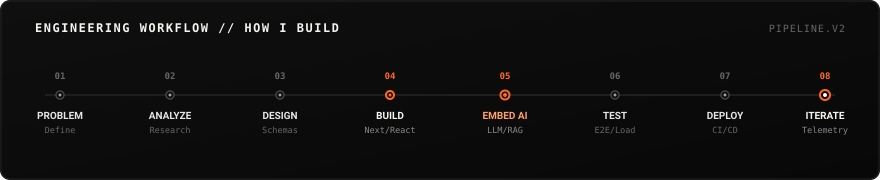
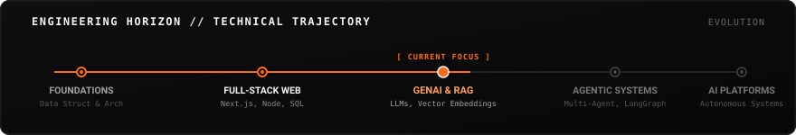

<div align="center">
  <!-- Signature Hero: Animated Intelligent Orange Thread -->
  <a href="https://github.com/nitinshah69">
    
  </a>
</div>

<br/>

## 🧭 About & Positioning

I am an **AI-focused Full-Stack Software Engineer** dedicated to building high-performance web applications, intelligent agentic workflows, and resilient cloud architectures.

```text
Focus:   Modern Frontend Architecture · GenAI Engineering · High-Throughput Systems
Mission: Bridging scalable full-stack web platforms with pragmatic machine intelligence.
```

---

## ⚡ Currently Building

```ini
[● ACTIVE] 01 — GenAI Applications & RAG Pipelines
[● ACTIVE] 02 — Production-Grade Web Systems (Next.js 14 / TypeScript)
[● ACTIVE] 03 — Agentic Workflows & Tool-Calling Systems
[● ACTIVE] 04 — E-Commerce & Telemetry Dashboards
[● ACTIVE] 05 — Distributed State & Real-Time Sync Engines
```

---

## 🔮 System Core

<div align="center">
  <table>
    <tr>
      <td width="55%" valign="middle">
        <h3>Architecture &amp; Philosophy</h3>
        <p>Software is built on three immutable pillars: <b>clean code</b>, <b>intelligent systems</b>, and <b>reliable shipping</b>.</p>
        <ul>
          <li><b>Precision Engineering:</b> Type-safe, modular, and maintainable systems.</li>
          <li><b>Applied Intelligence:</b> Practical GenAI integrations solving concrete user bottlenecks.</li>
          <li><b>Continuous Delivery:</b> Sub-second latency, CI/CD automation, and rigorous testing.</li>
        </ul>
      </td>
      <td width="45%" align="center" valign="middle">
        
      </td>
    </tr>
  </table>
</div>

---

## 🛠️ Technology Constellation

<table>
  <tr>
    <td width="33%" valign="top">
      <h4>Languages</h4>
      <ul>
        <li><code>TypeScript</code></li>
        <li><code>JavaScript (ES2024)</code></li>
        <li><code>Python</code></li>
        <li><code>SQL</code></li>
      </ul>
      <h4>Frontend</h4>
      <ul>
        <li><code>React.js</code></li>
        <li><code>Next.js 14 (App Router)</code></li>
        <li><code>Tailwind CSS</code></li>
        <li><code>HTML5 / CSS3</code></li>
      </ul>
    </td>
    <td width="33%" valign="top">
      <h4>Backend &amp; API</h4>
      <ul>
        <li><code>Node.js</code></li>
        <li><code>Express.js</code></li>
        <li><code>FastAPI</code></li>
        <li><code>PHP / RESTful APIs</code></li>
      </ul>
      <h4>AI / GenAI</h4>
      <ul>
        <li><code>LLM Integration &amp; APIs</code></li>
        <li><code>Retrieval-Augmented Gen (RAG)</code></li>
        <li><code>Vector Embeddings</code></li>
        <li><code>Agentic Tool Execution</code></li>
      </ul>
    </td>
    <td width="33%" valign="top">
      <h4>Database &amp; Storage</h4>
      <ul>
        <li><code>PostgreSQL</code></li>
        <li><code>Firebase / Firestore</code></li>
        <li><code>MySQL</code></li>
        <li><code>MongoDB</code></li>
      </ul>
      <h4>Infrastructure &amp; Tooling</h4>
      <ul>
        <li><code>Ubuntu Linux / Shell</code></li>
        <li><code>Git &amp; GitHub Actions</code></li>
        <li><code>Docker</code></li>
        <li><code>Vercel &amp; Cloud Deployment</code></li>
      </ul>
    </td>
  </tr>
</table>

---

## 🔄 Engineering Workflow // How I Build

<div align="center">
  
</div>

---

## 🚀 Featured Deployments

### 01 / AambaaLabs E-Commerce Infrastructure
<div align="center">
  
</div>

- **Problem:** Client required an enterprise store administration platform capable of multi-channel inventory sync and automated billing.
- **My Role:** Lead Full-Stack Engineer (Architecture, Database Schema, UI/UX, Firebase Telemetry).
- **Tech Stack:** `Next.js 14` · `React` · `Tailwind CSS` · `Firebase Firestore` · `Cloud Functions`
- **Technical Challenge:** Minimizing data latency on live inventory updates with sub-120ms optimistic UI synchronizations.
- **Links:** [Live Deployment ↗](https://github.com/nitinshah69) &nbsp;|&nbsp; [Repository ↗](https://github.com/nitinshah69/aambaalabs-dashboard)

---

### 02 / AI Resume Intelligence Platform
<div align="center">
  
</div>

- **Problem:** Job seekers struggle to evaluate resume alignment against algorithmic ATS systems and nuanced job descriptions.
- **My Role:** Creator & Full-Stack AI Engineer.
- **Tech Stack:** `Next.js` · `FastAPI` · `Python` · `OpenAI API` · `PostgreSQL`
- **Technical Challenge:** Structuring vector embeddings and prompt engineering pipelines for reliable, low-hallucination keyword gap extraction.
- **Links:** [Live Demo ↗](https://github.com/nitinshah69) &nbsp;|&nbsp; [Repository ↗](https://github.com/nitinshah69)

---

### 03 / Enterprise Cloud Workflow Hub
<div align="center">
  
</div>

- **Problem:** Eliminating disparate manual paper trails and fragmented operational tracking in institutional workflows.
- **My Role:** Architecture & Full-Stack Development.
- **Tech Stack:** `React.js` · `PHP Backend` · `MySQL` · `Tailwind CSS` · `JWT Auth`
- **Technical Challenge:** Designing complex relational data schemas with granular role-based access control (RBAC) and audited activity logs.
- **Links:** [Live Demo ↗](https://github.com/nitinshah69) &nbsp;|&nbsp; [Repository ↗](https://github.com/nitinshah69/capstone-project)

---

### 04 / RECKON 7.0 Real-Time Hackathon Sprint Engine
<div align="center">
  
</div>

- **Problem:** Building an ultra-responsive, collaborative web experience within a strict 24-hour sprint window.
- **My Role:** Core Frontend & Realtime State Lead.
- **Tech Stack:** `Next.js` · `TypeScript` · `Tailwind CSS` · `Firebase Realtime DB`
- **Technical Challenge:** Managing high-velocity concurrent state updates without UI jitter under tight hackathon time constraints.
- **Links:** [Live Demo ↗](https://github.com/nitinshah69) &nbsp;|&nbsp; [Repository ↗](https://github.com/nitinshah69/reckon-hackathon)

---

## 📈 Technical Horizon & Roadmap

<div align="center">
  
</div>

---

## 📊 Proof of Work & Activity

<div align="center">
  <!-- Minimal Monochrome Stats Card with Orange Accent -->
  
  
</div>

<br/>

<div align="center">
  <!-- Contribution Snake in Minimal Palette -->
  
</div>

---

## 📡 Live Development Signal

```text
● BUILDING   : Production AI tooling and scalable Next.js 14 micro-architectures
● LEARNING   : Advanced LLM tool calling, structured JSON outputs, and LangGraph
● EXPLORING  : Real-time agent collaboration protocols & edge compute runtimes
● 2026 GOAL  : Ship high-impact engineering products with world-class developer UX
```

---

## 🤝 Connect // Let's Build

Have an interesting engineering problem or high-impact project to collaborate on?

<div align="left">

- **LinkedIn:** [linkedin.com/in/nitinshah69 ↗](https://linkedin.com/in/nitinshah69)
- **GitHub:** [github.com/nitinshah69 ↗](https://github.com/nitinshah69)
- **Email:** [Reach out via Email ↗](mailto:nitinshah@example.com)

</div>

<br/>

<div align="center">
  <!-- Continuous Orange Thread Footer -->
  
</div>
