<div align="center">

  <!-- Dynamic Header Cylinder / Waving Banner -->
  

  <!-- 3D Binary Hologram Avatar HUD -->
  <table border="0" style="border: none; background: transparent;">
    <tr>
      <td align="center" style="border: none;">
        <div style="position: relative; display: inline-block;">
          
        </div>
        <br/>
        
      </td>
    </tr>
  </table>

  <!-- Dynamic Multi-Line Typewriter Animation -->
  <a href="https://git.io/typing-svg">
    
  </a>

  <br/>

  <!-- 3D Glow Status & Radar Badges -->
  <p align="center">
    <a href="https://linkedin.com/in/nitinshah69"></a>
    <a href="mailto:nitinshah@example.com"></a>
    <a href="https://github.com/nitinshah69"></a>
    
  </p>

  <!-- Live Engineering Status Bar -->
  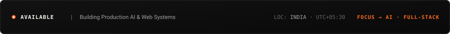

</div>

<br/>

## 🧭 03 / NOW · 2026 Command Center

```ini
[● BUILDING]   : Production AI Applications & Scalable Next.js 14 Web Systems
[● LEARNING]   : Agentic Workflows, LangGraph & Structured LLM Tool-Calling
[● EXPLORING]  : Production AI Observability & Low-Latency Edge Inference Runtimes
[● 2026 TARGET]: Senior Full-Stack & AI Systems Engineering
```

---

## 🏛️ 04 / About & Identity

```text
WHO I AM    : AI-focused Full-Stack Software Engineer building reliable, high-performance web products.
WHAT I BUILD: Intelligent web applications, agentic workflows, and distributed micro-frontends.
WHERE I GO  : Engineering scalable software systems that leverage practical machine intelligence.
```

---

## 💡 05 / What I Build

<table>
  <tr>
    <td width="33%" valign="top">
      <h4>🤖 Intelligent Products</h4>
      <p>AI-native web applications embedding LLM inference, vector retrieval (RAG), and agentic tool-calling to automate high-friction workflows.</p>
      <code>Next.js</code> · <code>FastAPI</code> · <code>OpenAI</code>
    </td>
    <td width="33%" valign="top">
      <h4>⚡ Full-Stack Systems</h4>
      <p>High-concurrency web platforms with optimized relational schemas, microsecond state synchronizations, and robust RBAC permissions.</p>
      <code>TypeScript</code> · <code>Node</code> · <code>Postgres</code>
    </td>
    <td width="33%" valign="top">
      <h4>🎨 Interactive Experiences</h4>
      <p>Ultra-responsive, accessible user interfaces engineered with micro-interactions, optimistic state updates, and modern design precision.</p>
      <code>React</code> · <code>Tailwind</code> · <code>Motion</code>
    </td>
  </tr>
</table>

---

## 🛠️ 06 / Current Stack & Layered Architecture

<table>
  <tr>
    <td width="20%" valign="top">
      <h4>Layer 01<br/>Interface</h4>
      <ul>
        <li><code>React.js</code></li>
        <li><code>Next.js 14</code></li>
        <li><code>TypeScript</code></li>
        <li><code>Tailwind CSS</code></li>
      </ul>
    </td>
    <td width="20%" valign="top">
      <h4>Layer 02<br/>Application</h4>
      <ul>
        <li><code>Node.js</code></li>
        <li><code>Express.js</code></li>
        <li><code>FastAPI</code></li>
        <li><code>Python</code></li>
      </ul>
    </td>
    <td width="20%" valign="top">
      <h4>Layer 03<br/>Persistence</h4>
      <ul>
        <li><code>PostgreSQL</code></li>
        <li><code>Firestore</code></li>
        <li><code>MySQL</code></li>
        <li><code>MongoDB</code></li>
      </ul>
    </td>
    <td width="20%" valign="top">
      <h4>Layer 04<br/>Intelligence</h4>
      <ul>
        <li><code>LLM APIs</code></li>
        <li><code>RAG Systems</code></li>
        <li><code>Embeddings</code></li>
        <li><code>LangGraph</code></li>
      </ul>
    </td>
    <td width="20%" valign="top">
      <h4>Layer 05<br/>Infra</h4>
      <ul>
        <li><code>Ubuntu Linux</code></li>
        <li><code>Docker</code></li>
        <li><code>GitHub CI/CD</code></li>
        <li><code>Vercel</code></li>
      </ul>
    </td>
  </tr>
</table>

---

## 📈 07 / Skill Progress System

<div align="center">
  <!-- Horizontal Journey Progress Lines -->
  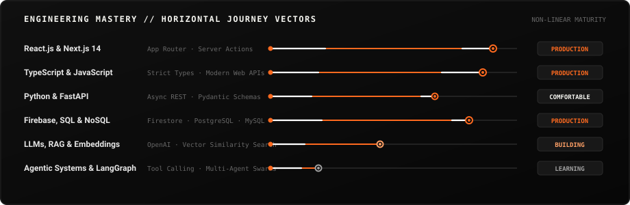
</div>

---

## 🌌 08 / Architectural Dependency Constellation

<div align="center">
  <!-- Architecture Constellation -->
  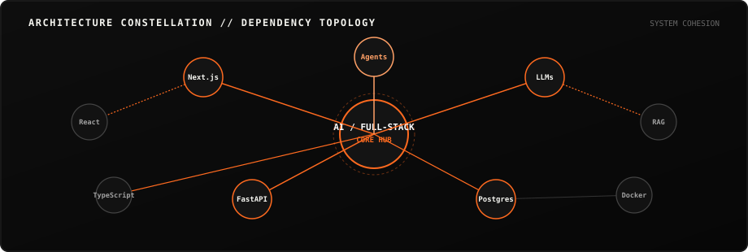
</div>

---

## 🗺️ 09 / My 2026 Learning Path

<div align="center">
  <!-- Learning Horizon -->
  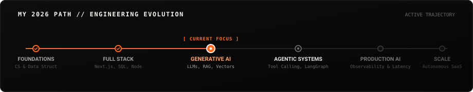
</div>

---

## 🚀 10 / Featured Project Showcases

### 01 / AambaaLabs E-Commerce Infrastructure
<div align="center">
  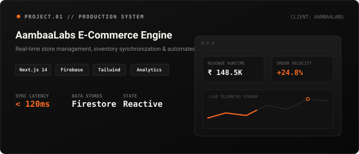
</div>

```text
Maturity:  [ PRODUCTION ────────────● ]
Radar:     Frontend: 95% | Backend: 90% | Database: 85% | Infra: 80%
```

- **Problem Solved:** Enterprise client needed unified store management, live multi-channel inventory synchronization, and automated billing.
- **My Role:** Lead Full-Stack Solutions Engineer.
- **Tech Stack:** `Next.js 14` · `React 18` · `Tailwind CSS` · `Firebase Firestore` · `Cloud Functions`
- **Technical Highlight:** Reduced inventory update latency below 120ms utilizing optimistic mutations and Firestore real-time snapshot listeners.
- **Links:** [Live Deployment ↗](https://github.com/nitinshah69) &nbsp;|&nbsp; [Source Code ↗](https://github.com/nitinshah69/aambaalabs-dashboard)

---

### 02 / AI Resume Intelligence Platform
<div align="center">
  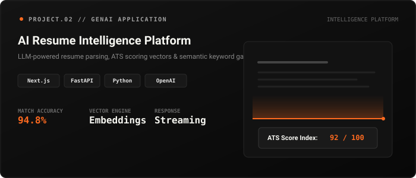
</div>

```text
Maturity:  [ MVP ──────────● ]
Radar:     AI / LLM: 92% | Frontend: 90% | Backend: 85% | Database: 75%
```

- **Problem Solved:** Job applicants lack transparent feedback on ATS alignment, semantic keyword gaps, and industry role fit.
- **My Role:** Creator & Full-Stack AI Engineer.
- **Tech Stack:** `Next.js` · `FastAPI` · `Python` · `OpenAI API` · `PostgreSQL`
- **Technical Highlight:** Designed semantic vector embedding pipeline for multi-dimension resume-to-job matching with low-hallucination structured JSON outputs.
- **Links:** [Live Demo ↗](https://github.com/nitinshah69) &nbsp;|&nbsp; [Source Code ↗](https://github.com/nitinshah69)

---

### 03 / Enterprise Cloud Workflow Hub
<div align="center">
  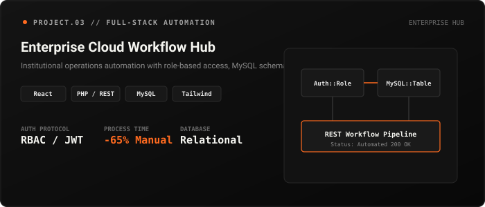
</div>

```text
Maturity:  [ PRODUCTION ────────────● ]
Radar:     Backend: 92% | Database: 90% | Frontend: 88% | Infra: 75%
```

- **Problem Solved:** Streamlined multi-department institutional operations by replacing manual administrative workflows with audited digital processes.
- **My Role:** Lead Full-Stack Developer.
- **Tech Stack:** `React.js` · `PHP Backend` · `MySQL` · `Tailwind CSS` · `JWT Authentication`
- **Technical Highlight:** Built scalable relational schemas with strict role-based access control (RBAC), resulting in a 65% reduction in manual turnaround time.
- **Links:** [Live Demo ↗](https://github.com/nitinshah69) &nbsp;|&nbsp; [Source Code ↗](https://github.com/nitinshah69/capstone-project)

---

### 04 / RECKON 7.0 Real-Time Hackathon Sprint Engine
<div align="center">
  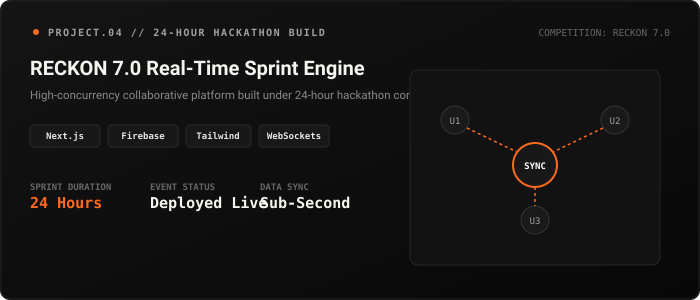
</div>

```text
Maturity:  [ MVP ──────────● ]
Radar:     Frontend: 94% | Database: 82% | Backend: 80% | Infra: 70%
```

- **Problem Solved:** Built a collaborative real-time digital application under a high-pressure 24-hour sprint.
- **My Role:** Core Frontend & Realtime State Lead.
- **Tech Stack:** `Next.js` · `TypeScript` · `Tailwind CSS` · `Firebase Realtime DB`
- **Technical Highlight:** Architected collision-free multi-client state management for concurrent collaborative sessions.
- **Links:** [Live Demo ↗](https://github.com/nitinshah69) &nbsp;|&nbsp; [Source Code ↗](https://github.com/nitinshah69/reckon-hackathon)

---

## 🔄 11 / Project Execution Pipeline // How I Build

<div align="center">
  <!-- Stage-Gate Project Pipeline -->
  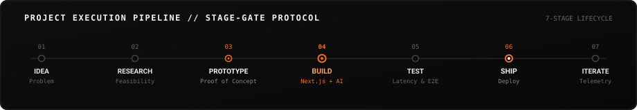
</div>

---

## 📊 12 / Activity Signal & Telemetry

<div align="center">
  <!-- Minimal Monochrome Stats Card with Orange Accent -->
  
  
</div>

---

## ⚡ 13 / Annual Contribution Cadence

<div align="center">
  <!-- Animated Contribution Signal -->
  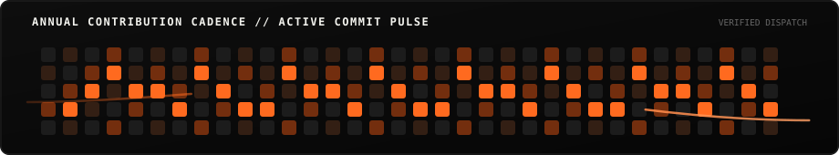
</div>

---

## 🌐 14 / 3D Contribution Topography

<div align="center">
  <!-- 3D Isometric Contribution Topography -->
  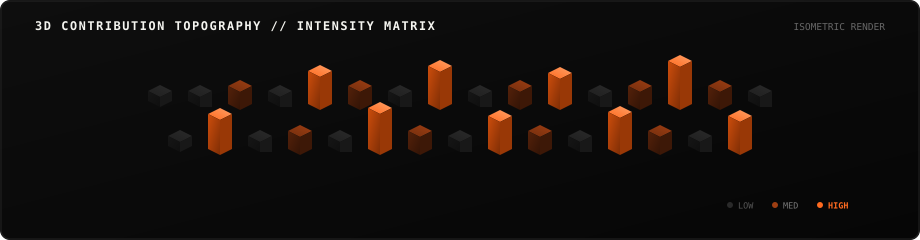
</div>

---

## 🗓️ 15 / 2026 Development Log & Timeline

<div align="center">
  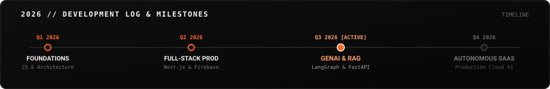
</div>

---

## 🔭 16 / Currently Exploring

- `→` Autonomous multi-agent coordination protocols (`LangGraph` / `LangChain`)
- `→` Edge-native AI model inference & streaming JSON responses
- `→` Vector database indexing optimizations (`Pinecone` / `pgvector`)
- `→` Advanced motion physics and micro-interactions in modern web apps

---

## 📐 17 / Engineering Principles // How I Think

<div align="center">
  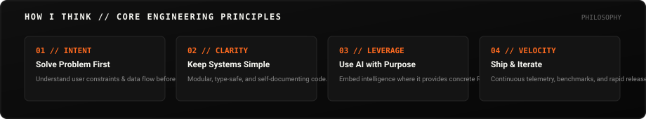
</div>

---

## 🪐 18 / Technology Orbit

<div align="center">
  <!-- Subtle Rotating Technology Orbit -->
  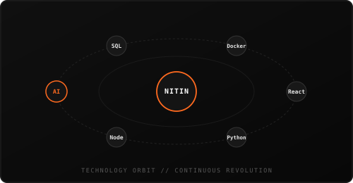
</div>

---

## 🤝 19 / Open Source & Collaboration

I actively contribute to and build open-source tools across web infrastructure, AI prototypes, and full-stack utilities.

- **Collaborate on GitHub:** [github.com/nitinshah69 ↗](https://github.com/nitinshah69)
- **Report an Issue / Suggestion:** Open an issue on any active repository.

---

## 📬 20 / Connect & Final CTA

<div align="center">
  <p><b>Have an interesting engineering problem to solve or a high-impact product to build?</b></p>
  
  <a href="https://linkedin.com/in/nitinshah69">
    
  </a>
  &nbsp;
  <a href="mailto:nitinshah@example.com">
    
  </a>
  &nbsp;
  <a href="https://github.com/nitinshah69">
    
  </a>

  <br/><br/>

  <!-- Final Narrative Closing Thread: BUILD -> LEARN -> SHIP -> EVOLVE -->
   EXPLORE -> BUILD -> LEARN -> SHIP -> EVOLVE" width="100%" />
  
  <br/>

  <!-- Final CTA Arrow -->
  
</div>
